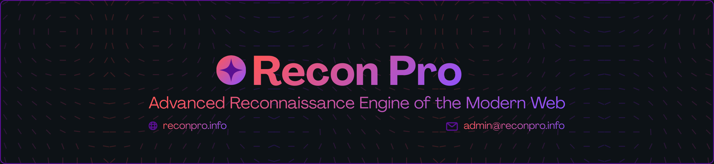
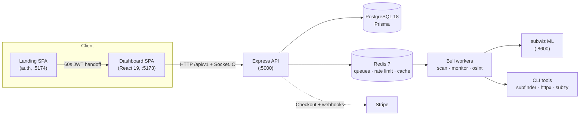

<div align="center">

# Recon Pro
<figure>
  
  <figcaption><em>Enumerate a domain's attack surface from a dozen sources, predict unseen subdomains
with ML, probe them live, and catch takeovers — with continuous monitoring, OSINT,
and a realtime dashboard. Built for penetration testers and bug-bounty hunters.</em></figcaption>
</figure>

<br />
<br />

[](LICENSE)
[](https://nodejs.org)
[](https://react.dev)
[](https://www.postgresql.org)
[](https://redis.io)
[](https://stripe.com)
[](#testing--ci)

**[Features](#what-it-does)** ·
**[Architecture](#architecture-at-a-glance)** ·
**[Quick Start](#quick-start-local-development)** ·
**[API](#api-reference)** ·
**[Security](#security)** ·
**[Docs](#documentation)**

</div>


## What it does

Recon Pro runs an **asynchronous scan pipeline** that enumerates a domain's attack
surface from many sources, predicts likely-unseen subdomains with an ML model,
probes them for liveness, checks for subdomain takeover, and streams progress live
to the browser. It also aggregates passive OSINT and can monitor a domain
continuously for changes.

Scans run as **server-side jobs** — start one, close the tab, come back on another
device, and the result is still there.

### Core capabilities

| Capability | How |
|---|---|
| **Subdomain enumeration** | `subfinder` (CLI) + passive APIs: Chaos, WhoisXML, VirusTotal, Shodan, SecurityTrails, Netlas, FullHunt, and certificate transparency (crt.sh / CertSpotter). Each source degrades gracefully if a key is missing or a provider is down. |
| **ML subdomain prediction** | A subwiz (transformer) microservice predicts unseen subdomains from the discovered set; predictions pass wildcard verification before being kept. |
| **HTTP probing** | `httpx` validates live hosts (status, title, tech, IP, server, port), with a domain-level asset-store cache to avoid re-probing fresh hosts. |
| **Takeover detection** | `subzy` flags vulnerable CNAMEs on live hosts; findings persist to the asset store. |
| **OSINT reports** | One-call domain intelligence (WHOIS, DNS, Shodan, VirusTotal, certificates, IP/ASN), run as a persisted server-side job, streamed live over Socket.IO. |
| **Continuous monitoring** | Scheduled re-scans with an added/removed change feed and alerts; monitors for the same domain share one scheduled scan. |
| **Realtime dashboard** | Scan progress over Socket.IO (no polling) + platform KPIs and per-user attack surface. |

### Authorization gate

A scan **cannot start** unless the user has attested authorization for the target
domain (`domain_attestations`) — a deliberate abuse-prevention control. Stored recon
data (takeovers, predicted hosts, change feed) is additionally gated on **owning a
scan or monitor** for that domain, so one tenant can never read another's findings.

### On the roadmap

Vulnerability scanning, secret scanning, and PDF/CSV reports are **not built yet** —
they appear in each plan's `comingSoon` list and are shown as "Soon", never billed
as a live feature.

---

## Tech Stack

| Layer | Technology |
|-------|-----------|
| **Frontend** | React 19, Vite 7, Axios, Socket.IO client, Lucide, DOMPurify, jsPDF |
| **Backend** | Node.js 20, Express 4, Prisma 6, Socket.IO 4, Bull 4, JWT + bcrypt, Joi, Helmet, Sentry, Winston, Stripe |
| **Data** | PostgreSQL 18, Redis 7 |
| **ML** | subwiz (Python / FastAPI, torch) |
| **Recon CLIs** | subfinder, httpx, subzy (pipeline); amass (OSINT endpoint) |

---

## Architecture (at a glance)



Two SPAs (dashboard + landing) share **one Postgres** and **one `JWT_SECRET`**.
Authentication lives entirely in the landing app; the dashboard has **no login
form**.

---

## Project Structure

```
reconpro/
├── src/                       # Dashboard SPA (React 19 + Vite)
│   ├── App.jsx                #   custom currentPage router (React.lazy, no react-router)
│   ├── api/ · components/ · context/ · hooks/
├── backend/                   # Express API + workers + ML service
│   ├── src/                   #   app · server · config · controllers · middleware · routes · services · workers
│   ├── prisma/                #   schema + migrations + seed  (OWNS all migrations)
│   └── ml/subwiz-service/     #   FastAPI subwiz prediction microservice
├── landing/                   # Landing site — owns login/signup (SPA :5174)
│   └── server/                #   Landing auth API :5001 (register, login, OAuth, JWT handoff)
├── docs/                      # ARCHITECTURE · DATABASE · DEPLOYMENT · PRODUCTION_READINESS
├── .env.shared                # shared DATABASE_URL + JWT_SECRET (gitignored)
└── .github/workflows/         # CI (frontend + backend) + self-hosted deploy
```

---

## API Reference

All routes are versioned under `/api/v1` (legacy `/api/*` → `307` redirect).

| Group | Base | Notes |
|-------|------|-------|
| Auth | `/api/v1/auth` | landing handoff exchange (`validate-token`), login, refresh, MFA-aware — no register (landing owns signup) |
| User | `/api/v1/user` | profile, password, MFA, stats, dashboard |
| Scans | `/api/v1/scans` | attestation, start/list/detail/cancel, takeovers, predicted, change feed |
| OSINT | `/api/v1/osint` | reports (server-side jobs + history), whois, dns, shodan, virustotal, certs, ip/asn, subzy |
| Probe | `/api/v1/probe` | httpx live-host probing (SSRF-filtered) |
| Monitors | `/api/v1/monitors` | continuous monitoring |
| Tools | `/api/v1/tools` | CLI tool install/health |
| Subscription | `/api/v1/subscription` | Stripe Checkout + Billing Portal; `webhook` is the sole tier-granting path |
| Queues | `/api/v1/queues` | Bull queue admin (admin-only) |
| Health | `/api/health*`, `/api/metrics` | probes + Prometheus |

---

## Authentication

The **landing app** owns registration, login, OAuth, and email verification. On
success it mints a **60-second HS256 JWT** stamped `source: landing_page` and
redirects to `${TOOL_URL}/auth/callback#token=<jwt>`. The dashboard exchanges it at
`POST /api/v1/auth/validate-token`, which verifies the signature + type against the
**shared `JWT_SECRET`**, looks the user up in the **shared Postgres**, and issues the
dashboard's own tokens:

- a short-lived **access token** (returned to the SPA), and
- a 7-day **refresh token** set as an **httpOnly, `SameSite=Strict` cookie** scoped to
  `/api/v1/auth` — never placed in `localStorage` or a response body, so XSS can't
  read it.

`JWT_SECRET` and `DATABASE_URL` live in a single root **`.env.shared`** loaded first
by both backends, so they're shared by construction. One Prisma schema
(`backend/prisma`) owns all migrations; the landing app only generates its client.

---

## Billing

Payments run through **Stripe Checkout** (hosted) and the **Billing Portal** — card
data never touches this server. A signature-verified **webhook**
(`POST /api/v1/subscription/webhook`, raw body, mounted before the JSON parser) is
the **only** path that grants or revokes a tier; the post-checkout redirect grants
nothing, so a closed tab or a forged redirect can't buy access. Webhook events are
**deduplicated** by id and **reconciled daily** against Stripe so a missed event
can't leak paid access. Products and prices are auto-provisioned from the
`SubscriptionPlan` rows on first checkout.

`STRIPE_SECRET_KEY` and `STRIPE_WEBHOOK_SECRET` are both **optional**: with neither
set the app boots normally and the Billing tab reports payments as disabled. (If the
secret key is set without the webhook secret, the server refuses to boot rather than
charge customers who'd never receive their tier.)

### Subscription tiers

Tiers differ **only** by the monthly OSINT quota and the rate limits below — **no
feature gating**. Every tier runs the same scanners. The billing table is generated
from the middleware that enforces these numbers, so the price page can't drift from
what's actually enforced.

| | Free | Pro | Enterprise |
|---|---|---|---|
| **OSINT reports / month** | **3** | **1,000** | **Unlimited** |
| OSINT requests / hour | 30 | 100 | 500 |
| Scans / hour | 5 | 50 | 200 |
| API requests / 15 min | 1,000 | 5,000 | 20,000 |
| API-key requests / hour | 1,000 | 5,000 | 20,000 |

The monthly quota resets lazily on a calendar boundary for every tier (no cron, no
dependence on Stripe webhooks).

---

## Security

Recon Pro runs attacker-influenced tooling against user-supplied domains, so the
security surface is treated as first-class:

- **Command execution** — every CLI spawn uses `execFile`/`spawn` with **argument
  arrays** (no shell interpolation), validated inputs, and timeouts with
  SIGTERM→SIGKILL escalation.
- **SSRF** — a resolve-then-check guard rejects loopback / RFC1918 / link-local /
  cloud-metadata targets; applied at every httpx entry point and re-checked on
  webhook redirects (no blind redirect following).
- **Tenant isolation** — all per-user data is `userId`-scoped; shared domain assets
  require an **owned scan/monitor**, not a self-asserted attestation.
- **Auth** — httpOnly `SameSite=Strict` refresh cookie, rotation with **reuse-family
  revocation**, typed handoff tokens, and a brute-force-capped login limiter.
- **Quota integrity** — the paid quota is reserved **atomically at admission** (no
  check-then-charge race), refunded on cache hit / failure.
- **Config safety** — the server **refuses to boot** in a production-looking
  environment unless `NODE_ENV=production` (so a config slip can't silently disable
  CORS/CSRF/HSTS/secure-cookies), and rejects weak/guessable secrets in production.
- **Platform** — Joi validation, mongo-sanitize + XSS strip, Prisma parameterised
  queries, Redis-backed tiered rate limiting (multi-instance safe), CSRF + Helmet
  CSP/HSTS, ownership-checked WebSockets, and non-root / hardened containers.


---

## Testing & CI

```bash
npm test                 # frontend (repo root)
cd backend && npm test   # backend  (NODE_ENV=test → in-memory rate-limit store)
```

- **123 tests** (47 backend + 76 frontend), covering the money path (webhook
  tier-flip, signature rejection), the quota gate, tenant-isolation (IDOR), auth
  handoff + refresh rotation, and the config tripwire.
- CI (`.github/workflows/ci.yml`) runs both suites on Node 20 with a Redis service;
  the self-hosted deploy runs the suite **before** migrating/restarting, so a red
  build never ships.

---

## Test Targets

For **authorized** testing only:

| Target | Purpose |
|--------|---------|
| `testphp.vulnweb.com` | Intentionally vulnerable site |
| `scanme.nmap.org` | Nmap's official test target |
| `hackerone.com` | Bug-bounty platform (safe to scan) |

---

## Disclaimer

For authorized security testing only. You are responsible for having permission to
scan any target — the in-app attestation gate enforces this. Unauthorized scanning
may violate applicable laws.

## License

MIT — see [LICENSE](LICENSE).

<div align="center">
<br />
Built with security tools from <a href="https://projectdiscovery.io/">ProjectDiscovery</a> and <a href="https://owasp.org/">OWASP</a>.
</div>
